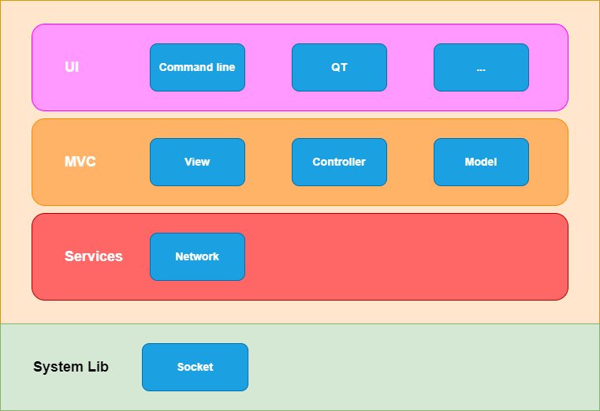

# ChatApp (Peer-to-Peer)

## 1. Introduction
ChatApp is a small peer-to-peer console chat application written in C++ (C++17) using sockets and threads. The code is organized into modular components (UI/view, controller, model, services, utils) and built with CMake.

## 2. Purpose
- Demonstrate a simple peer-to-peer messaging workflow.
- Provide a learning example for networking, multithreading, and CMake-based C++ projects.
- Be usable for small LAN chat experiments and debugging practice in VS Code.

## 3. Stack Software


Source diagram: [docs/StackSoftware.drawio](docs/StackSoftware.drawio)

Stack diagram description
- UI layer
  - Contains the user-facing interfaces (Command-line UI, optional Qt UI, etc.).
  - Responsible for presenting messages and accepting user commands (connect, send, list, terminate, etc.).
  - Forwards parsed commands as events to the Controller.

- MVC layer
  - View: Renders UI and displays updates; collects user input.
  - Controller: Interprets user commands, orchestrates actions, invokes services, and updates the Model.
  - Model: To do.

- Services layer
  - Network / Connection Service: Manages TCP listeners, outgoing connections, per-connection handlers, message send/receive and reconnection logic.

- System Libraries
  - Uses POSIX sockets and pthreads (or std::thread) through the C++ standard library interfaces.
  - Low-level networking here.

Data flow (high-level)
1. User types a command in the UI.
2. UI/View sends the command to Controller.
3. Controller validates and updates Model or calls Services (e.g., NetworkService::connect or send).
4. Network Service performs socket operations (listener, send/receive) on background threads.
5. Incoming network events are routed back to View for display.

## 4. Get the code, build and debug

Prerequisites
- Linux (development tested on Ubuntu)
- C++17 compiler (g++)
- CMake >= 3.10
- make
- VS Code with extensions: "CMake Tools" and "C/C++"

Clone repository
```sh
git clone <your-repo-url> ChatApp
cd ChatApp
```

Build (out-of-source recommended)
```sh
mkdir -p build
cd build
cmake ..
make
```

Run
```sh
./build/ChatApp
```


Configure CMake extension & debug in VS Code
1. Install "CMake Tools" and "C/C++" extensions.
2. Optional workspace settings (`.vscode/settings.json`):
```json
{
  "cmake.buildDirectory": "${workspaceFolder}/build",
  "cmake.configureOnOpen": false
}
```
3. Example debug launch config (`.vscode/launch.json`):
```json
{
  "version": "0.2.0",
  "configurations": [
    {
      "name": "Debug ChatApp",
      "type": "cppdbg",
      "request": "launch",
      "program": "${workspaceFolder}/build/ChatApp",
      "args": [],
      "stopAtEntry": false,
      "cwd": "${workspaceFolder}",
      "externalConsole": false,
      "MIMode": "gdb",
      "miDebuggerPath": "/usr/bin/gdb"
    }
  ]
}
```
4. Use the CMake status bar in VS Code to configure and build, then launch the debug configuration.

## 5. Usage guideline (commands / options)
When the app runs it exposes a console UI. Common commands:
- help — show help text
- myip — show local IP address
- myport — show listening port
- connect <ip> <port> — connect to a peer
- list — list all active connections (with connection ids)
- send <connection id> <message> — send a message to a peer
- terminate <connection id> — close a connection
- exit — shutdown the application

Notes
- Connection ids are shown by the `list` command after successful connects.
- `connect` can be used to create a symmetric conversation (both peers can connect to each other).
- Use `myport` to learn which port the local listener is using if the app chooses one dynamically

## 6. Example session

Host A (start listener)
```sh
# on host A
./build/ChatApp
# inside app:
> myport
# prints listening port (e.g. 5000)
```

Host B (connect to A)
```sh
# on host B
./build/ChatApp
# inside app:
> connect 192.168.1.10 5000
> list
# returns connection id 1
> send 1 Hello from B!
```

Back on Host A:
```
# receives message from B shown in console
> send 1 Hello back, B!
```

Terminate a connection
```
> terminate 1
> list  # connection removed
```

Shutdown
```
> exit
```

Troubleshooting
- Inspect build logs in `build/` (compile_commands.json or CMakeFiles) for compilation issues.
- Use the VS Code debugger to set breakpoints and step through networking code.